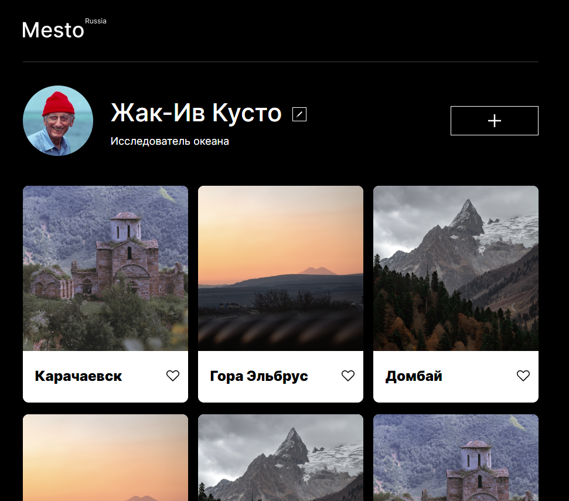

# Проект: Место 

 

## Описание:   

Проектная работа.  

Одностраничный лендинг.   

Реализована возможность изменить имя пользователя и поле о себе.  

Реализована возможность добавлять карточки, и отмечать понравившейся карточки "like".  

Реализована валидация полей ввода.  

В дальнейшем планируется возможность изменять аватар.  
 

* [Работа на GitHub Pages](https://apostaldante.github.io/mesto/)  

* [Ссылка на макет в Figma](https://www.figma.com/file/2cn9N9jSkmxD84oJik7xL7/JavaScript.-Sprint-4?node-id=0%3A1)
  

**Desktop**
  
